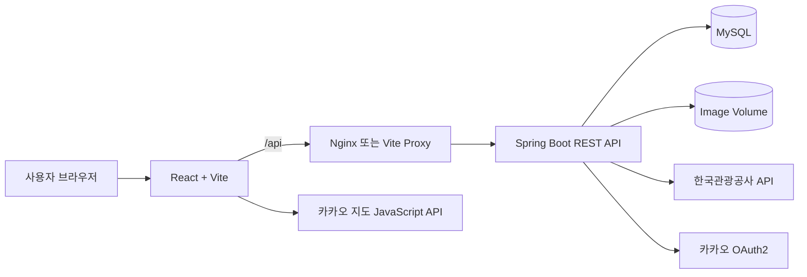
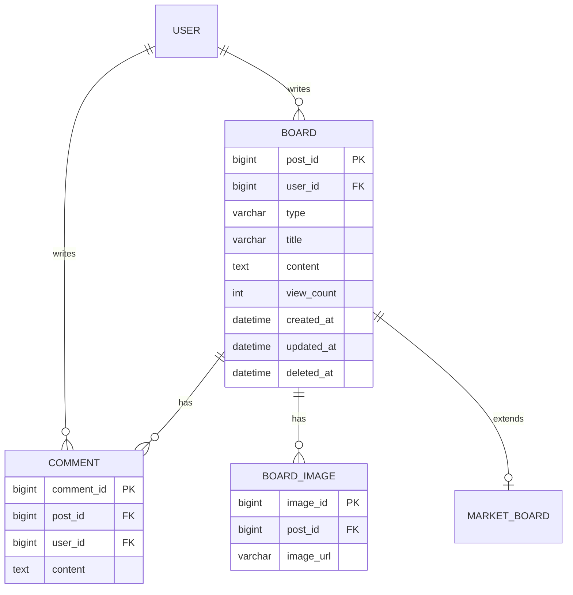
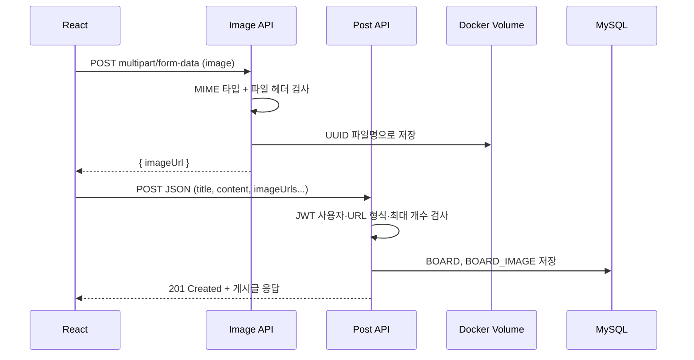

# 멍크크 (Meongkk)

> 반려견 동반 장소 탐색, GPS 산책 기록, 커뮤니티와 그룹 활동을 하나로 연결한 모바일 웹 서비스입니다.

[](https://openjdk.org/)
[](https://spring.io/projects/spring-boot)
[](https://www.mysql.com/)
[](https://react.dev/)
[](https://www.docker.com/)

- Frontend: [meongkk/daenggo-FE](https://github.com/meongkk/daenggo-FE)
- Backend: [meongkk/daenggo-backend](https://github.com/meongkk/daenggo-backend)

이 저장소는 React 프론트엔드 저장소입니다. 다만 프로젝트 전체 구조와 전민규의 백엔드 기여를 함께 파악할 수 있도록 백엔드 도메인, API 계약, 데이터 흐름과 트러블슈팅을 포함했습니다.

## 프로젝트 개요

| 항목 | 내용 |
| --- | --- |
| 개발 형태 | 4인 팀 프로젝트 |
| 개발 집중 기간 | 2026.07.15 ~ 2026.07.27 (Git 기록 기준) |
| 서비스 형태 | 모바일 우선 반응형 웹 |
| 핵심 목표 | 장소 탐색, 산책 기록, 보호자 커뮤니티를 하나의 서비스로 연결 |
| 개인 담당 | 커뮤니티 백엔드, 커뮤니티·지도 프론트 연동, Docker Compose·Nginx |

## 백엔드 포트폴리오 핵심

전민규는 커뮤니티 도메인을 중심으로 화면부터 DB까지 이어지는 기능을 구현했습니다.

- `Board`, `Comment`, `BoardImage`, `MarketBoard` 엔티티와 Repository·DTO 설계
- 게시글·댓글 CRUD, 카테고리별 목록, 조회수, 소프트 삭제 API 구현
- 요청 본문의 `userId`를 신뢰하던 구조를 JWT 인증 사용자 기반으로 변경
- 작성자만 수정·삭제할 수 있도록 Service 계층에서 소유권 검증
- 이미지의 MIME 타입과 실제 파일 헤더 검증, UUID 파일명 저장, 안전한 조회 경로 구현
- React 요청 → Spring Controller → Service → JPA Repository → MySQL 전체 흐름 연결
- MySQL·Spring Boot·React·Nginx를 함께 실행하는 Docker Compose 환경 구성

프론트엔드는 백엔드 API를 실제 사용자 흐름으로 검증하는 통합 클라이언트로 활용했습니다. 따라서 이 프로젝트의 개인 포트폴리오 초점은 UI 디자인보다 API 계약, 인증 경계, 데이터 모델과 장애 원인 추적에 있습니다.

## 주요 기능

| 영역 | 구현 내용 |
| --- | --- |
| 인증 | 이메일 회원가입·로그인, 카카오 OAuth2, JWT Access/Refresh Token, 자동 재발급, 인증 라우트 보호 |
| 지도·장소 | 카카오 지도, 현재 위치·지도 영역 기반 조회, 키워드·카테고리·반려견 조건 필터, 즐겨찾기 |
| 커뮤니티 | 자유·장터·시터 게시판, 게시글·댓글 CRUD, 다중 이미지, 작성자 권한 검증 |
| 산책 | GPS 경로, 시간·거리·페이스, 사진, 달력·상세·경로 조회 |
| 반려견 | 등록·수정·삭제, 대표 반려견, 견종과 몸무게 기반 크기 분류 |
| 그룹 | 생성·수정·삭제, 초대·강퇴·탈퇴, 그룹장 위임, 반려견·산책 기록 공유 |
| 마이페이지 | 회원 정보·프로필 이미지, 반려견·그룹·찜 목록, 로그아웃·회원 탈퇴 |

## 팀원별 담당 역할

| 팀원 | 담당 영역 | 주요 구현 내용 |
| --- | --- | --- |
| 정민주 | 산책 | 산책 Entity·API, GPS 경로, 시간·거리·페이스, 사진, 달력·상세 기록 |
| 석종수 | 인증·회원·반려견·그룹 | JWT·OAuth2, 회원·프로필, 반려견 CRUD·대표견, 그룹 관리·기록 공유 |
| 김태중 | 장소·관광공사 API | 장소 동기화, 지역·주변 조회, 출입 조건 파싱, 맞춤 필터, 즐겨찾기·제보 |
| 전민규 | 커뮤니티·지도 UI·실행 환경 | 게시글·댓글·이미지 API와 DB 모델, 작성자 권한, 프론트 API 연동, Docker Compose·Nginx |

요청 범위와 기여를 명확히 구분하기 위해 인증·산책·반려견·그룹·장소 백엔드 구현은 각 담당 팀원의 작업으로 표시했습니다.

## 시스템 구조



### 요청이 DB까지 이동하는 순서

```text
React 화면
→ Axios가 JSON 또는 multipart/form-data 요청 생성
→ Nginx/Vite가 /api 요청을 Spring Boot로 전달
→ Controller가 URL·HTTP Method·DTO 유효성 검사
→ Service가 인증 사용자·권한·비즈니스 규칙 검사
→ Repository가 JPA를 통해 MySQL 조회·저장
→ 응답 DTO가 JSON으로 변환되어 React State에 저장
→ State 변경에 따라 화면이 다시 렌더링
```

## 커뮤니티 도메인 설계



- `BOARD.deleted_at`에 시간이 있으면 목록과 상세 조회에서 제외하는 소프트 삭제(데이터 행은 남기고 삭제 상태만 기록하는 방식)를 사용합니다.
- 자유·장터·시터 게시글은 `BOARD.type`으로 구분하고, 장터 전용 가격·거래 상태는 `MARKET_BOARD`에 분리합니다.
- 이미지 파일은 파일 시스템/Docker Volume에 저장하고 DB에는 `BOARD_IMAGE.image_url`만 저장합니다.

## 커뮤니티 API

| 기능 | Method | Endpoint | 인증·처리 |
| --- | --- | --- | --- |
| 게시글 목록 | `GET` | `/api/community/posts?category=FREE` | 카테고리별 최신순 조회 |
| 게시글 상세 | `GET` | `/api/community/posts/{postId}` | 상세 응답과 조회수 증가 |
| 게시글 등록 | `POST` | `/api/community/posts` | JWT 사용자를 작성자로 저장 |
| 게시글 수정 | `PATCH` | `/api/community/posts/{postId}` | 작성자 일치 시 수정 |
| 게시글 삭제 | `DELETE` | `/api/community/posts/{postId}` | 작성자 일치 시 소프트 삭제 |
| 댓글 목록·등록 | `GET/POST` | `/api/community/posts/{postId}/comments` | JWT 사용자를 댓글 작성자로 저장 |
| 댓글 수정·삭제 | `PATCH/DELETE` | `/api/community/posts/{postId}/comments/{commentId}` | 댓글 작성자 검증 |
| 이미지 업로드 | `POST` | `/api/community/images` | 이미지 검증 후 URL 반환 |
| 이미지 조회 | `GET` | `/api/community/images/{fileName}` | 저장된 파일 Resource 응답 |

### 프론트 요청과 백엔드 저장 필드

게시글 등록 시 프론트 JSON과 백엔드 요청 객체의 필드는 다음과 같이 연결됩니다.

| 프론트 JSON | 백엔드 요청 필드 | DB 저장 위치 | 비고 |
| --- | --- | --- | --- |
| `category` | `CommunityCategory category` | `BOARD.type` | `FREE`, `MARKET`, `SITTER` |
| `title` | `String title` | `BOARD.title` | 빈 문자열 거부 |
| `content` | `String content` | `BOARD.content` | 빈 문자열 거부 |
| `imageUrls` | `List<String> imageUrls` | `BOARD_IMAGE.image_url` | 최대 5개, 서버 발급 URL만 허용 |
| `price` | `Integer price` | `MARKET_BOARD.price` | 장터 글만 사용, 0 이상 |
| `tradeStatus` | `String tradeStatus` | `MARKET_BOARD.trade_status` | `SELL` 또는 `BUY` |
| 전송하지 않음 | `Authentication.getName()` | `BOARD.user_id` | JWT subject인 이메일로 회원 조회 |

핵심은 작성자 ID를 JSON으로 받지 않는다는 점입니다. 클라이언트가 보내는 값은 사용자가 바꿀 수 있으므로, 서버가 검증한 JWT에서 로그인 사용자를 결정합니다.

## 이미지 등록 데이터 흐름



파일 업로드와 게시글 등록을 두 단계로 분리해 게시글 API는 JSON 구조를 유지했습니다. 단, 이미지 업로드 후 게시글 저장이 실패하면 연결되지 않은 파일이 남을 수 있으므로 운영 단계에서는 임시 업로드 상태와 정리 작업이 필요합니다.

## 인증과 권한 흐름

```text
로그인 성공
→ Access Token과 Refresh Token 저장
→ Axios 요청 인터셉터가 Authorization: Bearer {token} 추가
→ Spring Security가 토큰 서명·만료 검증
→ Controller가 Authentication.getName()으로 이메일 획득
→ Service가 이메일로 활성 회원 조회
→ 게시글/댓글 작성자 ID와 로그인 회원 ID 비교
→ 일치하면 수정·삭제, 다르면 403 Forbidden
```

Access Token 만료로 여러 API가 동시에 `401 Unauthorized`를 반환하면 프론트의 공통 `refreshPromise`가 재발급 요청 하나를 공유합니다. 재발급 성공 후 원래 요청을 한 번 다시 실행하고, 실패하면 토큰을 삭제해 로그인 만료 상태로 전환합니다.

## 트러블슈팅

### 1. 요청 본문의 `userId`를 믿어 다른 사용자 데이터에 접근할 수 있는 구조

**문제**

초기 게시글·댓글 등록과 수정·삭제 요청은 프론트가 `userId`를 JSON 또는 Query Parameter로 보냈습니다. 이 값은 브라우저 개발자 도구나 API 도구에서 바꿀 수 있어, 구조상 다른 회원 ID를 사칭할 위험이 있었습니다.

**원인**

로그인 기능 연결 전 사용하던 임시 사용자 ID가 실제 인증 도입 뒤에도 API 계약에 남아 있었습니다. 인증(Authentication)과 인가(Authorization, 접근 권한 확인)가 분리되지 않은 상태였습니다.

**해결**

- 프론트 환경변수 `VITE_BOARD_WRITER_ID`와 요청의 `userId`를 제거했습니다.
- 모든 커뮤니티 변경 요청을 JWT가 포함된 공통 Axios 클라이언트로 통일했습니다.
- Controller에서 `Authentication.getName()`으로 JWT subject인 이메일을 받았습니다.
- Service에서 활성 회원을 다시 조회하고 실제 게시글·댓글 작성자와 비교했습니다.
- 비작성자의 수정·삭제에는 `403 Forbidden`을 반환하도록 변경했습니다.

**결과와 배운 점**

클라이언트는 화면에 수정·삭제 버튼을 숨길 수 있지만, 최종 권한 검사는 반드시 서버가 해야 한다는 점을 코드에 반영했습니다. 요청 DTO도 실제로 신뢰할 수 있는 데이터만 받도록 단순해졌습니다.

- Backend: [`cb7c759` JWT 사용자 식별 전환](https://github.com/meongkk/daenggo-backend/commit/cb7c759)
- Frontend: [`ea93e84` 임시 사용자 제거](https://github.com/meongkk/daenggo-FE/commit/ea93e84)

### 2. 게시글 상세 진입 한 번에 조회수가 2 증가하는 문제

**문제**

개발 환경에서 상세 화면에 한 번 들어갔는데 조회수가 2씩 증가했습니다.

**원인**

React `StrictMode`는 개발 중 부수 효과를 찾기 위해 컴포넌트를 다시 마운트할 수 있습니다. 상세 화면의 `useEffect`가 두 번 실행되면서 상세 GET 요청도 연속 호출됐고, 백엔드는 상세 GET 안에서 매번 조회수를 증가시켰습니다.

**해결**

`postId`를 Key로 사용하는 `Map`에 진행 중인 Promise를 저장했습니다. 같은 게시글의 요청이 끝나기 전에 다시 호출되면 새 HTTP 요청을 만들지 않고 기존 Promise를 공유하고, 완료 뒤에는 Map에서 제거했습니다.

```js
const pendingBoardPostRequests = new Map();

export async function getBoardPost(postId) {
  const requestKey = String(postId);
  if (pendingBoardPostRequests.has(requestKey)) {
    return pendingBoardPostRequests.get(requestKey);
  }

  const request = apiClient.get(`/api/community/posts/${postId}`)
    .then((response) => response.data)
    .finally(() => pendingBoardPostRequests.delete(requestKey));

  pendingBoardPostRequests.set(requestKey, request);
  return request;
}
```

**결과와 한계**

동시에 발생한 동일 상세 요청은 한 번만 서버로 전달되고, 나중에 다시 방문하면 정상적으로 새 요청을 보냅니다. 다만 GET 요청이 조회수를 변경하는 현재 API는 완전한 멱등성(같은 요청을 반복해도 서버 상태가 같음)을 보장하지 않습니다. 운영 환경에서는 별도의 조회 기록 API나 서버 측 중복 기준을 두는 방식도 검토할 수 있습니다.

- Frontend: [`166ac87` 진행 중 상세 요청 공유](https://github.com/meongkk/daenggo-FE/commit/166ac87)

### 3. 장터 글 등록 후 자유 게시판으로 돌아가는 문제

**문제**

장터 또는 시터 게시글을 작성해도 등록 직후 `/board`로 이동해 기본값인 자유 게시판이 표시됐습니다. 뒤로가기를 사용해도 사용자가 선택한 카테고리가 유지되지 않았습니다.

**원인**

카테고리를 React State에만 저장하고 URL에는 남기지 않았으며, 게시글 등록 응답의 새 게시글 ID도 사용하지 않았습니다.

**해결**

- 목록·작성·상세 주소에 `?category=MARKET` 형태로 카테고리를 저장했습니다.
- 등록 API가 반환한 `createdPost.id`로 상세 화면에 이동했습니다.
- 상세에서 목록으로 돌아갈 때도 Query Parameter를 유지했습니다.

**결과와 배운 점**

새로고침과 뒤로가기 이후에도 화면 상태를 복원할 수 있게 됐습니다. 공유하거나 다시 방문해야 하는 상태는 컴포넌트 State만이 아니라 URL에도 표현해야 한다는 점을 확인했습니다.

- Frontend: [`77bd3d1` 게시판 이동 상태 보존](https://github.com/meongkk/daenggo-FE/commit/77bd3d1)

### 4. 이미지 파일과 게시글 데이터를 안전하게 연결하기

**문제**

이미지를 게시글 JSON에 직접 넣을 수 없고, 확장자만 검사하면 이미지로 위장한 파일이나 위험한 파일명을 저장할 수 있습니다. 컨테이너를 다시 만들 때 업로드 파일이 사라지는 문제도 고려해야 했습니다.

**해결**

- 업로드 API와 게시글 등록 API를 분리했습니다.
- 서버에서 허용 MIME 타입과 실제 파일 시작 바이트를 함께 검사했습니다.
- 원본 파일명 대신 UUID를 사용하고, 정규식과 정규화된 경로로 조회 범위를 제한했습니다.
- 게시글에는 서버가 발급한 URL 형식만 최대 5개까지 연결했습니다.
- Docker Volume을 `/app/uploads`에 연결해 컨테이너 재생성 뒤에도 파일을 유지했습니다.

**결과와 한계**

DB에는 파일 자체가 아니라 URL이 저장되고, 파일 저장소와 관계형 데이터의 역할이 분리됐습니다. 현재는 로컬 Volume 방식이므로 여러 서버로 확장할 때는 S3 같은 Object Storage(파일 전용 저장소)와 파일 정리 정책이 필요합니다.

- Backend: [`bfc320c` 이미지 업로드·조회](https://github.com/meongkk/daenggo-backend/commit/bfc320c)
- Backend: [`55b846f` 이미지 연결 검증·편집](https://github.com/meongkk/daenggo-backend/commit/55b846f)
- Backend: [`64a7876` Docker·Nginx·Volume 구성](https://github.com/meongkk/daenggo-backend/commit/64a7876)

## 대표 Git 작업 근거

| 구분 | 커밋 | 확인할 수 있는 내용 |
| --- | --- | --- |
| DB 모델 | [`8383bbe`](https://github.com/meongkk/daenggo-backend/commit/8383bbe) | 게시글 Entity와 테이블 매핑 |
| API 계층 | [`12673ba`](https://github.com/meongkk/daenggo-backend/commit/12673ba), [`cc4e62f`](https://github.com/meongkk/daenggo-backend/commit/cc4e62f) | DTO·Repository·Controller·Service 연결 |
| 댓글 | [`c16a807`](https://github.com/meongkk/daenggo-backend/commit/c16a807) | 댓글 등록·조회·수정·삭제 |
| 조회 | [`1807314`](https://github.com/meongkk/daenggo-backend/commit/1807314) | 목록·상세·조회수 API |
| 인증 전환 | [`cb7c759`](https://github.com/meongkk/daenggo-backend/commit/cb7c759) | 임시 사용자 제거, JWT 사용자·소유권 검증 |
| 통합 연동 | [`7221089`](https://github.com/meongkk/daenggo-FE/commit/7221089), [`ea93e84`](https://github.com/meongkk/daenggo-FE/commit/ea93e84) | React 게시글 등록과 인증 API 연동 |
| 실행 환경 | [`64a7876`](https://github.com/meongkk/daenggo-backend/commit/64a7876) | Dockerfile, Compose, Nginx Reverse Proxy |

## 기술 스택

### Backend

- Java 21, Spring Boot 4.1
- Spring Web MVC, Spring Data JPA, Bean Validation
- Spring Security OAuth2 Client·Resource Server, JWT
- MySQL 8.4
- Maven, Lombok, Springdoc OpenAPI

### Frontend

- React 19, Vite 8
- React Router DOM 7
- Axios
- Kakao Maps JavaScript API, Geolocation API
- CSS 기반 모바일 레이아웃

### Infra

- Docker Compose
- Nginx Reverse Proxy와 SPA Fallback
- MySQL·이미지 Named Volume

## 저장소 구조

```text
daenggo-FE/
└── src/
    ├── components/        # 공통 내비게이션과 UI
    ├── features/
    │   ├── auth/          # 로그인·OAuth·토큰
    │   ├── board/         # 커뮤니티 화면과 API
    │   ├── group/         # 그룹
    │   ├── map/           # 지도·장소·필터
    │   ├── mypage/        # 마이페이지
    │   ├── pet/           # 반려견
    │   └── walk/          # 산책 기록
    ├── lib/               # Axios 공통 클라이언트·오류 처리
    └── App.jsx            # 전체 라우팅

daenggo-backend/
└── src/main/java/com/daenggo/backend/
    ├── auth/              # JWT·Refresh Token·OAuth2
    ├── board/             # 게시글·댓글·이미지
    ├── favorite/          # 즐겨찾기
    ├── group/             # 그룹
    ├── pet/               # 반려견·견종
    ├── place/             # 장소·외부 API 동기화
    ├── user/              # 회원
    ├── walk/              # 산책·경로·사진
    └── global/            # Security·CORS·OpenAPI 설정
```

## 실행 방법

### 프론트엔드만 실행

PowerShell에서 다음 폴더로 이동합니다.

```powershell
cd C:\Users\zxzx0\Desktop\daenggo-FE
Copy-Item .env.example .env
npm.cmd install
npm.cmd run dev
```

`.env`에는 다음 값을 설정합니다.

```env
VITE_API_ORIGIN=http://localhost:8080
VITE_BOARD_WRITE_API_URL=/api/community/posts
VITE_WALK_API_URL=/api/walks
VITE_PLACE_API_URL=/api/places
VITE_KAKAO_MAP_JAVASCRIPT_KEY=발급받은_JavaScript_키
VITE_KAKAO_MAP_KEY=발급받은_같은_JavaScript_키
```

현재 지도 코드에서 카카오 키 환경변수 이름을 두 가지로 사용하므로 같은 JavaScript 키를 모두 설정해야 합니다. `.env`를 바꿨다면 개발 서버를 종료한 뒤 다시 실행합니다.

### Docker Compose로 전체 실행

두 저장소를 같은 상위 폴더에 둡니다.

```text
project/
├── daenggo-backend/
└── daenggo-FE/
```

백엔드 저장소에 DB·JWT·카카오·관광공사 API 환경변수를 설정한 뒤 실행합니다.

```powershell
cd C:\Users\zxzx0\Desktop\daenggo-backend
docker compose up -d --build
```

| 서비스 | 주소 |
| --- | --- |
| Frontend | `http://localhost:5173` |
| Backend API | `http://localhost:8080` |
| Swagger UI | `http://localhost:8080/swagger-ui/index.html` |
| MySQL | `localhost:3306` |

`docker compose down -v`는 MySQL과 이미지 Volume까지 삭제할 수 있으므로 데이터 초기화가 목적일 때만 사용해야 합니다.

## 검증 명령어

### Frontend

```powershell
cd C:\Users\zxzx0\Desktop\daenggo-FE
npm.cmd run lint
npm.cmd run build
```

정상이라면 lint 오류 없이 종료되고 `dist` 폴더에 배포용 파일이 생성됩니다.

### Backend

```powershell
cd C:\Users\zxzx0\Desktop\daenggo-backend
.\mvnw.cmd test
.\mvnw.cmd clean package
```

정상이라면 Maven이 `BUILD SUCCESS`로 끝나고 `target` 폴더에 실행 가능한 JAR가 생성됩니다.

## 현재 한계와 개선 계획

- 커뮤니티를 포함한 도메인별 자동화 테스트가 부족해 회귀 오류를 빠르게 발견하기 어렵습니다.
- 게시글 상세 GET이 조회수를 변경하므로 서버 측 중복 조회 정책을 추가할 필요가 있습니다.
- 이미지 업로드 성공 후 게시글 저장이 실패하면 미사용 파일이 남을 수 있습니다.
- Access/Refresh Token을 브라우저 저장소에 두는 현재 방식은 XSS 공격에 주의해야 합니다. 운영 환경에서는 HttpOnly Cookie 방식도 비교해야 합니다.
- 카카오 지도 환경변수 이름이 `VITE_KAKAO_MAP_JAVASCRIPT_KEY`, `VITE_KAKAO_MAP_KEY` 두 가지로 나뉘어 있어 하나로 통일해야 합니다.
- 실제 배포 URL, 대표 화면 이미지와 API 통합 테스트 결과는 아직 문서에 포함하지 않았습니다.

이 항목들은 구현 완료 사실과 앞으로 보완할 부분을 구분하기 위해 공개합니다.

## 관련 저장소

- [Frontend Repository](https://github.com/meongkk/daenggo-FE)
- [Backend Repository](https://github.com/meongkk/daenggo-backend)
