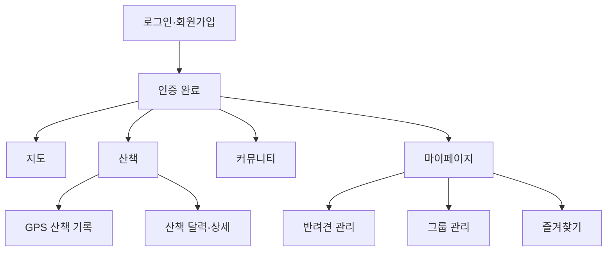

# 멍크크 Frontend

> 반려견 동반 장소 탐색, 산책 기록, 커뮤니티와 그룹 활동을 모바일 앱처럼 이용할 수 있는 React 웹 애플리케이션입니다.

[](https://react.dev/)
[](https://vite.dev/)
[](https://reactrouter.com/)
[](https://axios-http.com/)

## 프로젝트 소개

멍크크는 반려견과 함께 갈 수 있는 장소를 지도에서 확인하고, 산책 경로를 기록하며, 보호자들과 정보를 나누는 반려생활 플랫폼입니다. 스마트폰에서 네이티브 앱처럼 사용할 수 있도록 고정 헤더·하단 내비게이션·내부 스크롤을 적용한 모바일 우선 UI로 구현했습니다.

- Frontend: [meongkk/daenggo-FE](https://github.com/meongkk/daenggo-FE)
- Backend: [meongkk/daenggo-BE](https://github.com/meongkk/daenggo-BE)

## 주요 화면과 기능

| 영역 | 구현 내용 |
| --- | --- |
| 인증 | 이메일 회원가입·로그인, 카카오 로그인, JWT 저장, Access Token 자동 재발급, 인증 라우트 보호 |
| 지도 | 카카오 지도, 현재 위치와 지도 영역 기반 장소 조회, 카테고리·반려견 조건 필터, 검색·지역 목록 |
| 장소 | 장소 미리보기·상세 패널, 반려견 출입 조건 확인, 카카오맵 연결, 즐겨찾기 관리 |
| 커뮤니티 | 자유·장터·시터 게시판, 카테고리별 목록, 게시글·댓글 작성·수정·삭제, 다중 이미지 등록 |
| 산책 | 산책 시작, GPS 경로 기록, 시간·거리 표시, 사진 촬영, 산책 완료·수정·삭제, 달력·상세·경로 조회 |
| 반려견 | 반려견 목록, 등록·수정·삭제, 프로필 이미지, 대표 반려견 설정, 견종 선택 |
| 그룹 | 그룹 생성·수정·삭제, 그룹원 초대·강퇴·탈퇴, 그룹장 위임, 그룹원 반려견·산책 기록 조회 |
| 마이페이지 | 내 정보 조회·수정, 프로필 이미지, 찜 목록, 로그아웃과 회원 탈퇴 |

## 화면 구조



## 기술 스택

- React 19
- Vite 8
- React Router DOM 7
- Axios
- Kakao Maps JavaScript API
- Geolocation API
- CSS 기반 모바일 앱 레이아웃
- Nginx, Docker Compose

## 프로젝트 구조

```text
src
├── assets                  # 이미지와 SVG 아이콘
├── components              # 하단 내비게이션, 지도 등 공통 UI
├── features
│   ├── auth                # 로그인, 회원가입, OAuth, 토큰 관리
│   ├── board               # 커뮤니티 목록·작성·상세
│   ├── group               # 그룹 목록·생성·상세
│   ├── map                 # 장소 지도·검색·상세·즐겨찾기
│   ├── mypage              # 마이페이지 화면
│   ├── pet                 # 반려견 등록·수정
│   ├── profile             # 프로필 이미지 처리
│   ├── user                # 회원 API
│   └── walk                # 산책 달력·기록·경로·상세
├── lib                     # Axios 클라이언트와 공통 오류 처리
├── App.jsx                 # 전체 라우팅
└── main.jsx                # React 진입점
```

## 라우팅

| 경로 | 화면 |
| --- | --- |
| `/login` | 로그인 |
| `/signup` | 회원가입 |
| `/oauth/callback` | 카카오 로그인 완료 처리 |
| `/map` | 반려견 동반 장소 지도 |
| `/walk` | 산책 달력 |
| `/walk/tracking/:walkId` | 실시간 산책 기록 |
| `/walk/:walkId` | 산책 상세 |
| `/board` | 커뮤니티 목록 |
| `/board/write` | 게시글 작성 |
| `/board/:id` | 게시글 상세 |
| `/mypage` | 마이페이지 |
| `/mypage/pets` | 반려견 관리 |
| `/mypage/groups` | 그룹 관리 |

로그인이 필요한 화면은 `RequireAuth`가 토큰을 확인하고, 인증 정보가 없으면 로그인 화면으로 이동시킵니다.

## 실행 방법

### 1. 환경변수 설정

`.env.example`을 복사해 `.env` 파일을 만들고 값을 입력합니다.

```powershell
Copy-Item .env.example .env
```

```env
VITE_API_ORIGIN=http://localhost:8080
VITE_BOARD_WRITE_API_URL=/api/community/posts
VITE_WALK_API_URL=/api/walks
VITE_PLACE_API_URL=/api/places

# 카카오 Developers에서 발급받은 JavaScript 키
VITE_KAKAO_MAP_JAVASCRIPT_KEY=
VITE_KAKAO_MAP_KEY=
```

현재 지도 코드에서 두 카카오 환경변수 이름을 사용하므로 같은 JavaScript 키를 모두 설정합니다.

### 2. 개발 서버 실행

```powershell
npm install
npm run dev
```

개발 주소는 기본적으로 http://localhost:5173 입니다. Vite 개발 서버는 `/api`와 `/uploads` 요청을 `http://localhost:8080`으로 전달합니다.

### 3. 검사와 빌드

```powershell
npm run lint
npm run build
npm run preview
```

## Docker로 전체 프로젝트 실행

프론트엔드와 백엔드 저장소를 같은 상위 폴더에 배치합니다.

```text
프로젝트/
├── daenggo-backend/
└── daenggo-FE/
```

백엔드 폴더에서 실행합니다.

```powershell
docker compose up -d --build
```

Docker Compose가 React를 빌드하고 Nginx에서 정적 파일을 제공하며, `/api` 요청을 Spring Boot 컨테이너로 전달합니다.

## API 연결과 JWT 재발급

공통 `apiClient`가 로그인 후의 API 요청을 담당합니다.

```text
API 요청
→ 저장된 Access Token을 Authorization 헤더에 추가
→ 서버가 401을 반환하면 Refresh Token으로 재발급 요청
→ 새 토큰 저장
→ 실패했던 원래 요청을 한 번 다시 실행
→ 재발급도 실패하면 토큰 삭제 후 로그인 만료 처리
```

여러 요청이 동시에 401을 받더라도 하나의 재발급 요청을 공유해 중복 호출을 줄입니다.

## 커뮤니티 데이터 흐름

```text
게시글 작성 화면
→ 선택한 이미지를 multipart/form-data로 업로드
→ 백엔드에서 받은 이미지 URL 수집
→ 제목·내용·카테고리·이미지 URL을 게시글 API로 전송
→ 등록된 카테고리 목록으로 이동
→ GET /api/community/posts?category=FREE 형태로 다시 조회
```

장터 게시글은 거래 종류와 가격을 추가로 전송하고, 게시글·댓글 수정 및 삭제는 로그인한 작성자에게만 표시하고 백엔드에서도 권한을 검증합니다.

## 모바일 UI 원칙

- 최대 너비 400px의 앱 형태 레이아웃
- 화면 높이를 채우는 고정 컨테이너
- 헤더와 하단 내비게이션 고정
- 내용 영역만 세로 스크롤
- 긴 제목·본문·이미지로 인한 가로 비율 붕괴 방지
- 지도·산책·커뮤니티·마이페이지 간 일관된 하단 이동 구조

## 개발 상태와 주의사항

- 현재 개발 단계의 프로젝트이며 브라우저 위치 권한과 카카오 API 키가 필요합니다.
- `.env` 파일과 실제 API 키는 Git에 커밋하지 않습니다.
- 이미지 URL은 실제 이미지 파일이 아니므로 백엔드의 업로드 저장소와 함께 유지해야 합니다.
- Docker 환경에서 소스를 변경했다면 프론트엔드 이미지를 다시 빌드해야 화면에 반영됩니다.

## 관련 저장소

- [Frontend Repository](https://github.com/meongkk/daenggo-FE)
- [Backend Repository](https://github.com/meongkk/daenggo-BE)
